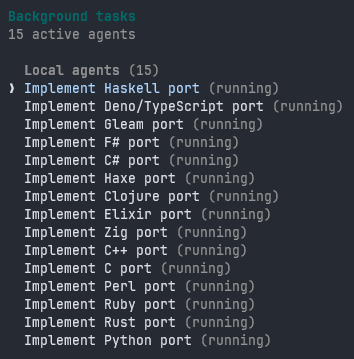
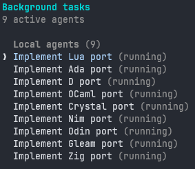

# sprite-scripts

CLI tools for launching and managing coding agents on [sprites.dev](https://sprites.dev) cloud environments.

Spin up a sprite, push your plan, launch [OpenCode](https://opencode.ai) or [Claude Code](https://docs.anthropic.com/en/docs/claude-code), and let it build while you grab coffee. Auto-checkpointing saves your work. Poll progress from your host machine via [beads](https://github.com/steveyegge/beads).

## Scripts

| Script | Description |
|--------|-------------|
| `sprite-launch` | Create a sprite, push files, install agent + beads, and start coding |
| `sprite-push` | Push a local file or directory to a sprite |
| `sprite-pull` | Pull a file or directory from a sprite |
| `sprite-watch` | Monitor a beads tracker task for project progress |

## Quick Start

```bash
# 1. Create a .env with your sprites.dev token
cp .env.example .env
# Edit .env with your SPRITES_TOKEN

# 2. Write a plan
cp example-plan.md plan.md
# Edit plan.md with your project spec

# 3. Launch (uses OpenCode with free models by default)
./sprite-launch my-project plan.md
```

That's it. No API keys needed for the default setup — OpenCode ships with free models.

### Configuring OpenCode with Groq

Add your Groq API key to `.env` for access to fast Llama models:

```bash
# .env
GROQ_API_KEY="gsk_your_key_here"
```

```bash
MODEL=groq/llama-3.3-70b-versatile ./sprite-launch my-project plan.md
```

### Configuring OpenCode with Zen

[OpenCode Zen](https://opencode.ai/docs/zen/) is a curated model gateway with tested, benchmarked models optimized for coding. Pay-as-you-go pricing with team/workspace support.

To use Zen models, connect inside the sprite after launch:

```bash
./sprite-launch my-project  # opens console (no plan file)
# Inside the sprite:
opencode                    # opens TUI
# Type /connect, select Zen, paste your Zen API key
# Type /models to see available Zen models
```

Or set it up non-interactively if you have a Zen API key:

```bash
# Add to .env
OPENCODE_ZEN_API_KEY="your_zen_key_here"
```

### Configuring Claude Code

To use Claude Code instead of OpenCode:

**With Claude subscription (free — uses your existing plan):**

```bash
# Make sure you've run `claude` locally at least once to authenticate
AGENT=claude ./sprite-launch my-project plan.md
```

This copies your local `~/.claude/.credentials.json` to the sprite. No API charges.

**With Anthropic API key (pay-per-token):**

```bash
# Add to .env
ANTHROPIC_API_KEY="sk-ant-your_key_here"
```

```bash
AGENT=claude CLAUDE_AUTH=apikey MODEL=sonnet ./sprite-launch my-project plan.md
```

## Usage

### sprite-launch

```bash
# OpenCode with free model (default)
./sprite-launch my-project plan.md

# Upload data, tests, or docs alongside the plan
./sprite-launch --upload ./data my-project plan.md
./sprite-launch --upload ./data --upload ./tests --upload ./docs my-project plan.md

# OpenCode with Groq
MODEL=groq/llama-3.3-70b-versatile ./sprite-launch my-project plan.md

# Claude Code with subscription
AGENT=claude ./sprite-launch my-project plan.md

# Claude Code with specific model
AGENT=claude MODEL=sonnet ./sprite-launch dev plan.md

# Preview without executing
./sprite-launch --dry-run my-project plan.md

# Disable auto-checkpointing
./sprite-launch --no-checkpoint my-project plan.md

# Custom checkpoint interval (10 min)
CHECKPOINT_INTERVAL=600 ./sprite-launch my-project plan.md

# Just open a console (no plan)
./sprite-launch my-project
```

The `--upload` flag pushes a local directory to `/home/sprite/<dirname>` on the sprite. Use it to send data files, test suites, reference docs, or starter code alongside your plan. Repeatable for multiple directories.

### sprite-push / sprite-pull

```bash
# Push files to sprite
./sprite-push ./src /home/sprite/src my-project
./sprite-push ./config.json /home/sprite/config.json my-project

# Pull results back
./sprite-pull /home/sprite/output ./output my-project
./sprite-pull /home/sprite/app.log ./app.log my-project
```

### sprite-watch

```bash
# Auto-detect and watch the critical tracker task
./sprite-watch my-project

# Watch a specific task
./sprite-watch my-project CRM-1

# Custom poll interval (60s)
./sprite-watch my-project CRM-1 60
```

## Environment Variables

| Variable | Default | Description |
|----------|---------|-------------|
| `ENV_FILE` | `./.env` | Path to .env file |
| `SPRITES_TOKEN` | | sprites.dev API token |
| `AGENT` | `opencode` | `opencode` or `claude` |
| `CLAUDE_AUTH` | `subscription` | `subscription` or `apikey` |
| `MODEL` | | Model override |
| `CHECKPOINT_INTERVAL` | `300` | Seconds between auto-checkpoints |

## Supported Models

**OpenCode** (free built-in models — no API key needed):
`opencode/big-pickle`, `opencode/glm-4.7-free`, `opencode/gpt-5-nano`, `opencode/kimi-k2.5-free`

**OpenCode + Groq** (free w/ API key):
`groq/llama-3.3-70b-versatile`, `groq/meta-llama/llama-4-scout-17b-16e-instruct`

**OpenCode + Zen** (pay-as-you-go, curated models):
See [OpenCode Zen docs](https://opencode.ai/docs/zen/) for available models

**OpenCode + other providers** (add API keys to .env):
`openai/gpt-4o`, `anthropic/claude-sonnet-4-20250514`, `google/gemini-2.5-pro`

**Claude Code** (requires subscription or API key):
`opus`, `sonnet`, `haiku`

## How It Works

1. Creates (or reuses) a sprite on sprites.dev
2. Pushes your `.env` and plan file into the sprite
3. Initializes git and installs [beads](https://github.com/steveyegge/beads) for task tracking
4. Installs and authenticates your chosen coding agent
5. Starts auto-checkpointing in the background
6. Launches the agent with your plan
7. Creates a final checkpoint when the agent finishes

Use `sprite-watch` from your host to poll the agent's progress via beads.

## Requirements

- [sprites.dev](https://sprites.dev) account and CLI
- For OpenCode agent: nothing (free models available), or API keys for premium models
- For Claude agent: Claude subscription or Anthropic API key

## Language Ports

All four scripts have been ported to **26 languages** as a unified `sprite-tool` binary/script with subcommands (`launch`, `push`, `pull`, `watch`). Each port lives under `ports/<language>/` and shells out to the `sprite` CLI.

The entire porting effort — all 26 languages — took **less than 4 hours** using Claude Code with parallel agents.




### Compiled Languages

| Language | Directory | Build |
|----------|-----------|-------|
| Rust | `ports/rust/` | `cargo build --release` |
| Go | `ports/go/` | `go build -o sprite-tool ./cmd/sprite-tool` |
| C | `ports/c/` | `make` |
| C++ | `ports/cpp/` | `cmake -B build && cmake --build build` |
| Zig | `ports/zig/` | `zig build -Doptimize=ReleaseSafe` |
| D | `ports/d/` | `dub build` |
| Nim | `ports/nim/` | `nim c -d:release src/sprite_tool.nim` |
| Crystal | `ports/crystal/` | `crystal build src/sprite_tool.cr` |
| Odin | `ports/odin/` | `odin build src -o:speed` |
| Ada | `ports/ada/` | `gprbuild -P sprite_tool.gpr` |
| Swift | `ports/swift/` | `swift build -c release` |
| Haxe | `ports/haxe/` | `haxe build.hxml` |

### JVM/BEAM/Managed Languages

| Language | Directory | Build/Run |
|----------|-----------|-----------|
| Clojure | `ports/clojure/` | `clj -M -m sprite-tool.core` |
| Elixir | `ports/elixir/` | `mix escript.build` |
| Gleam | `ports/gleam/` | `gleam build` |
| Haskell | `ports/haskell/` | `cabal build` |
| OCaml | `ports/ocaml/` | `dune build` |
| C# | `ports/csharp/` | `dotnet build` |
| F# | `ports/fsharp/` | `dotnet build` |

### Scripting Languages

| Language | Directory | Run |
|----------|-----------|-----|
| Python | `ports/python/` | `python -m sprite_tool` |
| Ruby | `ports/ruby/` | `ruby bin/sprite-tool` |
| Perl | `ports/perl/` | `perl bin/sprite-tool` |
| Lua | `ports/lua/` | `lua sprite-tool.lua` |
| Deno/TypeScript | `ports/deno/` | `deno run --allow-all src/main.ts` |
| Common Lisp | `ports/common-lisp/` | `sbcl --script sprite-tool.lisp` |
| Forth | `ports/forth/` | `gforth sprite-tool.fs` |

## Links

- [sprites.dev docs](https://docs.sprites.dev/)
- [beads - git-backed issue tracker](https://github.com/steveyegge/beads)
- [OpenCode docs](https://opencode.ai/docs)
- [OpenCode Zen](https://opencode.ai/docs/zen/)
